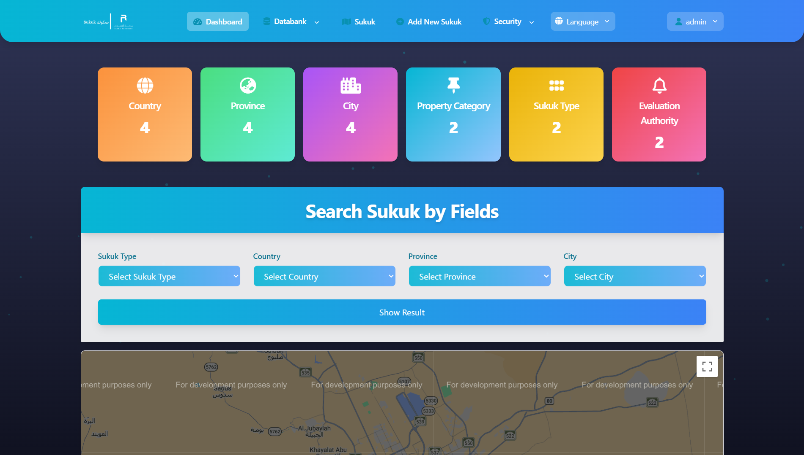
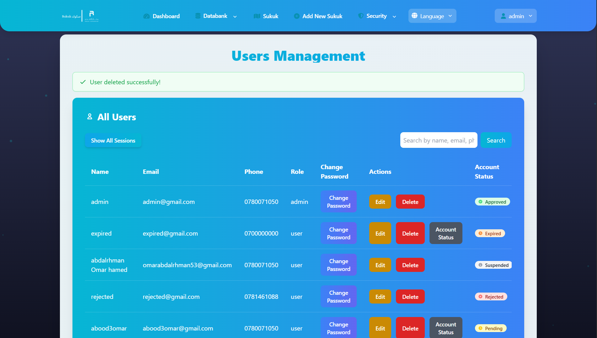
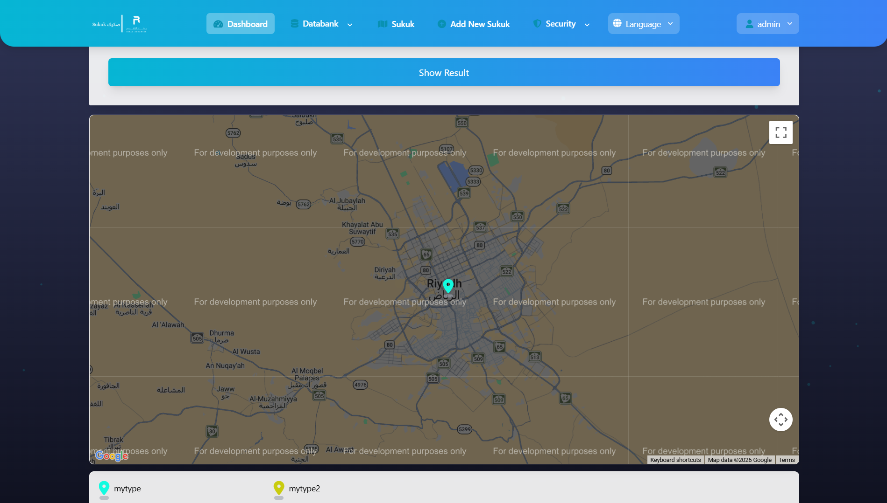

# Sukuk | Real Estate Investment Management System

> **⚠️ Proprietary Software Notice:**
> This repository serves as a **technical showcase** and architectural overview of the "Sukuk" project developed for **Rikaz Advanced**.
> Due to Non-Disclosure Agreements (NDA) and commercial property rights, the source code is stored in a private repository.
>
> **Access to the source code can be granted to recruiters and technical interviewers upon request.**
> [Request Access](mailto:abdalrhman.hamed@example.com) ---

## 📖 Project Overview
**Sukuk** is a comprehensive financial technology (FinTech) platform designed to manage real estate investment instruments (Sukuk). The system bridges the gap between investors and real estate opportunities, providing a secure environment for data management, subscription workflows, and portfolio tracking.

### 🏗️ High-Level Architecture
The system utilizes a **Monolithic Architecture** optimized for modularity using Laravel's component-based structure. It follows the **MVC (Model-View-Controller)** pattern, enhanced with **Service Layers** to handle complex business logic (subscriptions, approvals, and notifications) separately from controllers.

---

## 🔧 Technical Stack & Key Features

### 1. Advanced Role-Based Access Control (RBAC) 🛡️
Instead of using simple packages, I implemented a custom, highly granular permission system to handle sensitive financial data.
* **Implementation:** Utilized Laravel **Middleware** and **Gates/Policies**.
* **Workflow:**
    * `Admin`: Full system control & approval authority.
    * `Investor`: Access to personal portfolio and subscription requests.
    * `Manager`: Data oversight without modification rights.
* **Security:** Routes are protected via strict Middleware groups `['auth', 'role:admin']`.

### 2. Database Design & Eloquent ORM 🗄️
Designed a normalized relational database schema to ensure data integrity for financial records.
* **Complex Relationships:** Heavily utilized `Polymorphic Relations` and `Many-to-Many` relationships between *Users*, *Sukuk Portfolios*, and *Transactions*.
* **Optimization:** Implemented **Eager Loading** (`with()`) throughout the application to eliminate the **N+1 Query Problem**, ensuring fast response times even with large datasets.
* **Data Integrity:** Used **Database Transactions** (`DB::transaction`) to ensure that investment subscriptions and balance updates are atomic (all-or-nothing).

### 3. Interactive UI & API Integration 🌐
* **Google Maps API:** Integrated interactive maps for real estate location visualization using JavaScript API.
* **AJAX & Dynamic Content:** Built seamless forms and dynamic dashboards using **AJAX** to update investment statuses without page reloads, enhancing User Experience (UX).
* **Tailwind CSS:** Utilized for a responsive, mobile-first design that matches Rikaz's branding guidelines.

### 4. Code Quality & Scalability 🚀
* **Modular Code:** Logic is encapsulated in **Traits** and **Services** to keep Controllers "skinny."
* **Input Validation:** Robust server-side validation using **Form Request Classes** to sanitize all user inputs and prevent SQL Injection/XSS.
* **Migrations & Seeding:** Full database version control using Migrations, with Factories/Seeders for testing environments.

---

## 📸 System Gallery (Showcase)

| **Dashboard Overview** | **User Management (RBAC)** |
|:---:|:---:|
|  |  |
| *Dynamic charts tracking investments* | *Admin panel for role assignment* |

| **Google Maps Integration** | **Investment Workflow** |
|:---:|:---:|
|  |  |
| *Real-time location picking* | *Approval process flow* |

*(Note: These screenshots represent the revamped V2 architecture).*

---

## 🚀 Live Demo Disclaimer
There is a deployed version available at `sukuk.innowizard.com`.
> **Note:** The live deployment may reflect an earlier version (v1). The architectural improvements and code quality described in this document reflect the **v2 codebase** (current private repository).

---

## 📬 Contact & Access
To discuss the technical implementation or request a code walkthrough:

* **Abdalrhman Hamed**
* **Role:** Backend Software Engineer
* **Email:** [Your Email Here]
* **LinkedIn:** [Your Profile Link Here]
